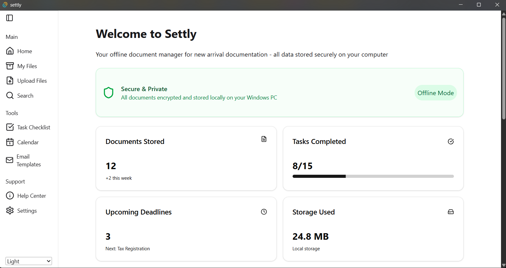

# Settly


</a>

</br>

<div align="center">
    <a href="https://x.com/hfa_dev" target="_blank">
        
    </a>
</div>

##

> ⚠️ This is a work-in-progress app.

##

Settly is a lightweight and secure desktop application that helps new arrivals to a country organise mandatory documents, keep track of deadlines, and facilitate communication with local authorities.

### Features MVP

- [ ] Upload documents (PDFs & images)
- [ ] View documents in-app
- [ ] Categorize documents (ID, Contracts, Insurance, Official Letters)
- [ ] Add metadata: expiry date, document number, country
- [ ] Store data locally
- [ ] Local toast notifications
- [ ] Basic OCR for scanned documents/images
- [ ] Create/edit tasks (e.g., register at town hall, open a bank account)
- [ ] Basic email/letter templates
- [ ] Hotkeys

### Post-MVP

- [ ] Encrypt files & metadata locally
- [ ] Replace placeholders with user/document data
- [ ] Setup i18n
- [ ] Export .ics calendar events
- [ ] Auto-fill metadata fields from extracted text
- [ ] OCR in multiple languages
- [ ] Export/import user profile
- [ ] Create multiple user profiles
- [ ] Support two languages
- [ ] Support two languages
- [ ] Support two languages

## Download

> SOON PERHAPS

</br>

## APP

Built with:

- [Tauri](https://tauri.app/) - Build smaller, faster, and more secure desktop applications with a web frontend.
- [React](https://reactjs.org/) - A JavaScript library for building user interfaces.
- [React Router v7](https://reactrouter.com/) - For routing in React.

## Getting Started

Prerequisites:

[Node.js (LTS recommended)](https://nodejs.org/en)

[Rust](https://www.rust-lang.org/tools/install)

Windows: Download the [Microsoft C++ Build Tools installer](https://visualstudio.microsoft.com/visual-cpp-build-tools/) and check "Desktop development with C++” option.

Setup:

1. Clone the repository:

```bash
git clone https://github.com/Hfanes/Settly
```

2. Install dependencies:

```bash
# Access the project folder:
cd settly

# Install dependencies:
npm install
```

3. Run the app

```bash
 npm run tauri dev
```

## Recommended IDE Setup

- [VS Code](https://code.visualstudio.com/) + [Tauri](https://marketplace.visualstudio.com/items?itemName=tauri-apps.tauri-vscode) + [rust-analyzer](https://marketplace.visualstudio.com/items?itemName=rust-lang.rust-analyzer)
